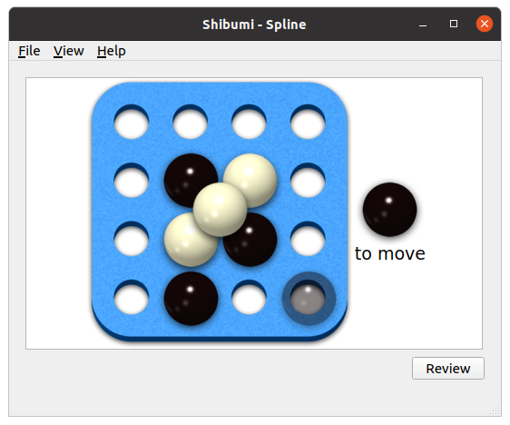

The goal of this project is a Python program to play several games in the
[Shibumi] game system, and to build computer opponents for those games.

I'm planning to keep a [journal] for the project.

[Shibumi]: https://boardgamegeek.com/boardgame/135270/shibumi
[journal]: journal
