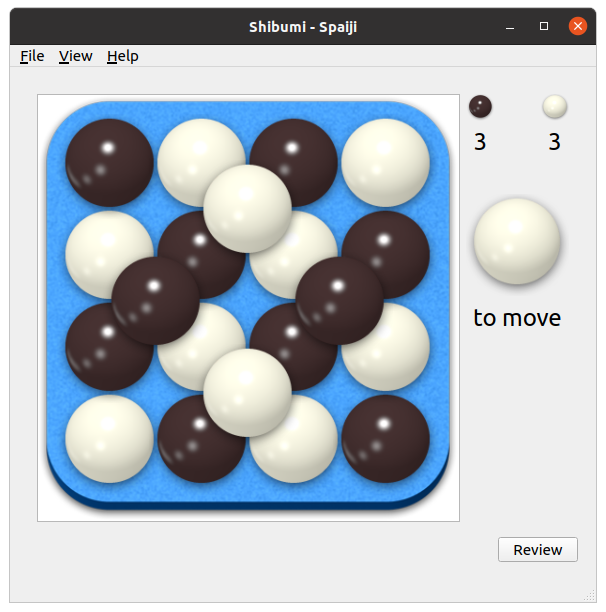

## 2018
In [2018], I started the project, building on top of [Alpha Zero General], a
Python implementation of the Alpha Zero project. I got the Spline rules
implemented, but I couldn't train a neural network to be any good at it.

[2018]: 2018.md
[Alpha Zero General]: https://github.com/suragnair/alpha-zero-general

## 2019
In late 2018 and [2019], I started the [Zero Play] project as a rewrite of Alpha
Zero General that was designed to be used as a library to build other games on
top of. I also experimented with MiniGo, but couldn't figure out how to extend
it.

[2019]: 2019.md
[Zero Play]: https://donkirkby.github.io/zero-play/

## 2020
### Aug 2020
Used the new GUI feature of Zero Play to build a GUI for Spline. This made it
easy to play a bunch of games against the basic MCTS AI, and it's really hard to
beat at 600 MCTS iterations. I did manage to beat it a few times when I was the
second player, and it made surprising choices. I think when all its choices are
guaranteed to lose eventually, it will sometimes pick a move that loses
immediately. 

![First GUI for Spline]

I also converted the web site to my new favourite template: Bulma Clean Theme.

[First GUI for Spline]: 2020/first_spline_gui.png

### Sep 2020
The weird moves were caused by a bug I found in most of the games: reporting
valid moves even after the game had ended. That stopped the AI from taking
advantage of the wins it found.

Added Spargo to the collection, and got the AI working. It kept getting stuck in
infinite loops, until I added the superko rule. Unfortunately, that required a
major rewrite. Instead of writing `Game` classes that passed around numpy arrays
for the board states, I converted them all to `GameState` classes that contain a
numpy array. That let me hold a set of previous board states within the
`GameState` class, so I could check for repeated positions. Now, the Spargo AI
works, although it doesn't seem too smart at a few hundred iterations. However,
it did surprise me with this comeback:

![Spargo nearly dead]

The AI was playing black here, and I thought I had it nearly defeated. However,
it played something I didn't expect at all:

{:start="14"}
14. 2D

![Spargo surprise]

That was surprisingly effective, because it allowed a response without violating
the ko rule. I thought it made sense to capture, but see how that turned out:

{:start="14"}
14. ... 1A
15. 1C

![Spargo no ko]

That's almost the same as the position above, except that now it's white's turn
to move, instead of black's.

I tried to build up higher in the bottom right, but I couldn't break out of the
ko cycle.

{:start="15"}
15. ... 2F
16. 2D 1A
17. 1C 2D
18. 5A 1A
19. 3A 5A

That forced me into this unpleasant position:

![Spargo doomed]

Now the AI can capture all my pieces with:

{:start="20"}
20. 5E

The AI still isn't that great, so I was able to recover and win the game, but I
was pleasantly surprised to learn something from the AI. After going back and
reviewing the moves, I think the correct play for me was to wait another turn
before capturing.

{:start="14"}
14. ... 2F

![Spargo wait]

Now, whether black responds with 5A or 1A, I can capture everything and roll on
to victory.

[Spargo nearly dead]: 2020/spargo-nearly-dead.png
[Spargo surprise]: 2020/spargo-surprise.png
[Spargo no ko]: 2020/spargo-no-ko.png
[Spargo doomed]: 2020/spargo-doomed.png
[Spargo wait]: 2020/spargo-wait.png

### Oct 2020
Added Margo as 6x6 version of Spargo, and fixed a few bugs by breaking
connections with covered marbles. Also added a sandbox mode. As the sandbox
mode added more features, I decided to move a bunch of controls out of the
graphics scene and into regular widgets.

Added Spaiji game, and the ability to choose which colour to play. The most fun
part of Spaiji was discovering a scenario not covered in the rules, and
discussing a solution with Néstor. While I was testing, it crashed when it found
positions with no valid moves, like this:

In that position, you can play one marble, but then there are no neighbouring
spaces that you can play the second one. After discussion with Néstor, we
decided that the game should end immediately, and then the winner is decided as
usual by the biggest connected group. In this case, they are tied at 3, so Black
wins the tie.

Now attempting to improve Spargo performance. I'm running 100 iterations, and
the current code takes 11 seconds per move. I used `cProfile`, and found that
the `find_neighbours()` function was a hot spot. I split that into
`find_possible_neighbours()` and `find_neighbours()`, where
`find_possible_neighbours()` is static and caches the results. That was a big
improvement, and brought it down to 7 seconds per move.

I tried a couple of other cached methods, but they weren't significant. What
was surprisingly effective was switching some `IntEnum` values to `int`. I
noticed that about 7% of the run time was being spent in `EnumMeta.__getattr__()`,
so I switched several references. That brings the performance to a little under
4 seconds per move.

### Nov 2020
Finished adding Spire. New games now take about two days, if they don't require
any new features. I have yet to achieve an ideal game where a player places
their own colour on the peak of the pyramid. I did manage to place a red on the
peak, but that's a loss.